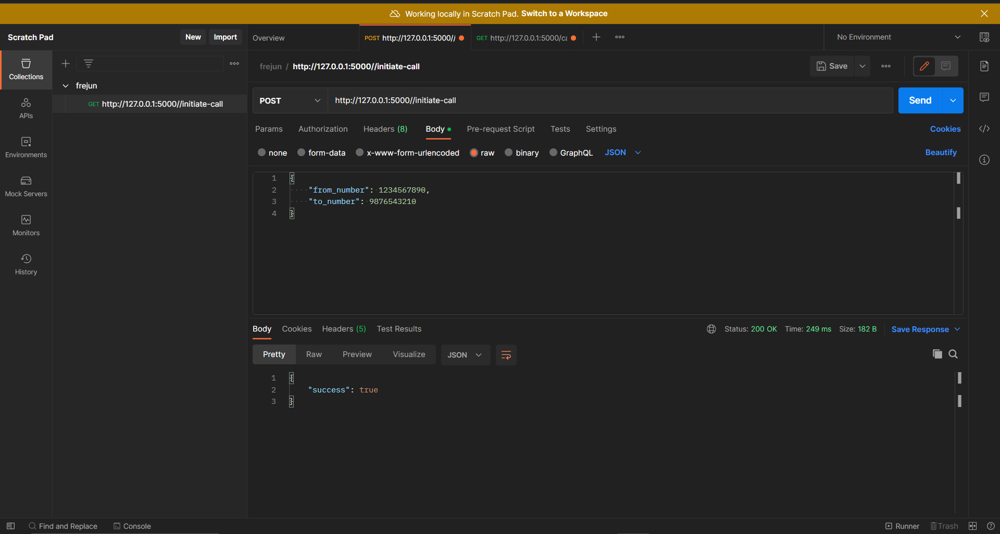
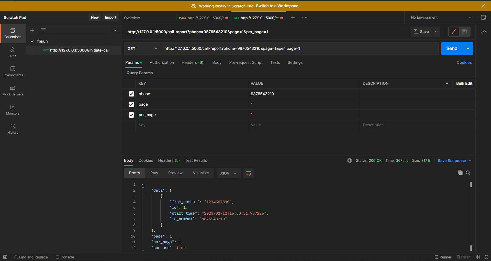

### Getting Started

* #### Prerequisites
  * Python 3.10 or higher
  * Flask
  
* #### Installation  
   To get a local copy up and running follow 
these simple example steps.

  1. Clone the repo

     `git clone https://github.com/singharsh10/FreJun.git`
  2. Creating virtual environment
      
     `pip install virtualenv`
  
      `virtualenv my_name`
  3. Install requirements
    
     `pip install -r requirements.txt`
  4. Start Flask server
    
     `flask --app app run`

-----------------------
### Usage

initiate-call endpoint

call-record endpoint

